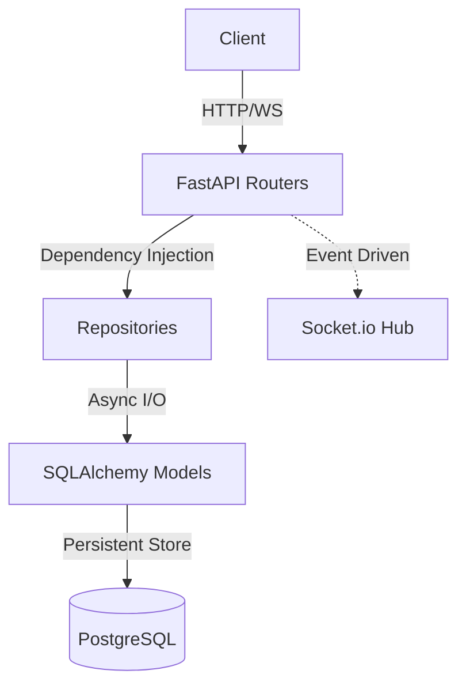

# 🚴‍♂️ SafeRide API - Professional Backend

[](https://www.python.org/)
[](https://fastapi.tiangolo.com)
[](https://pytest.org)

**SafeRide API** is a modern, high-performance back-end service built with FastAPI, designed for real-time tracking and management of group bicycle rides.

## 🚀 Key Features
- **Real-time Geolocation:** Efficient group tracking powered by Socket.io.
- **Secure Authentication:** JWT-based auth with modern password hashing (`Argon2`/`Bcrypt` via `pwdlib`).
- **Async-First Stack:** High-concurrency architecture using FastAPI, Async SQLAlchemy 2.0, and PostgreSQL.
- **Robust Data Integrity:** Group ride access controlled via unique 6-character UUID-based codes.

## 🛠 Tech Stack
- **Framework:** FastAPI.
- **Database:** PostgreSQL (Production/Dev), SQLite (Testing).
- **ORM:** SQLAlchemy 2.0 (Async extension).
- **Migrations:** Alembic.
- **Real-time Engine:** Python-SocketIO.
- **Security:** `pwdlib` for hashed storage, `PyJWT` for session management.
- **Testing:** Comprehensive Pytest suite (138 integration and unit tests).

## 📐 Architecture
The project implements a clean **Router-Repository** pattern to ensure strict separation of concerns and maintainability.



## 🚦 Quick Start (Docker)

Get the production-ready environment up and running in seconds:

1. **Start Services:**
   ```bash
   docker-compose up --build
   ```
2. **Seed Database:**
   ```bash
   docker-compose exec backend python seed_data.py
   ```
3. **Explore API Docs:** [http://localhost:8000/docs](http://localhost:8000/docs)
   - **Test Credentials:** `vadim` / `123456`

## 🧪 Testing and Quality
Reliability is a priority, with full coverage of security, concurrency, and core business logic.
```bash
# Run the full test suite inside Docker
docker-compose exec backend pytest -v
```

## 📂 Repository Structure
- `app/models.py` — Database schema definitions.
- `app/repositories/` — Isolated data access logic.
- `app/routers/` — REST API endpoint definitions.
- `app/security.py` — Core security and hashing implementation.
- `tests/` — Extensive integration and safety test suite.