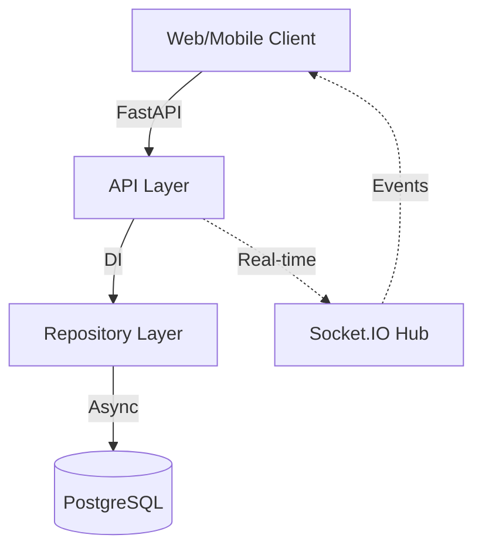

# 🏗 SafeRide Backend Architecture

This document details the architectural decisions and data flow of the SafeRide API, optimized for high-performance real-time tracking.

## 📐 System Overview

The system is built on a decoupled **Stateless Backend** architecture using FastAPI. It leverages asynchronous I/O to handle simultaneous HTTP requests and WebSocket events efficiently.

## 📂 Layered Design Patterns

### 1. Router Layer (Presentation)
- **Responsibility:** Endpoint definition, request validation (Pydantic), and response serialization.
- **Location:** `app/routers/`
- **Key Files:** `auth.py`, `rides.py`, `participations.py`.

### 2. Repository Layer (Data Access)
- **Responsibility:** All database interactions. Implements the **Repository Pattern** to abstract SQLAlchemy complexity from the business logic.
- **Location:** `app/repositories/`
- **Pattern:** Every repository receives an `AsyncSession` via FastAPI dependency injection.

### 3. Service Layer (Business Logic)
- **Responsibility:** Orchestrates complex operations involving multiple repositories or non-HTTP triggers (like WebSockets).
- **Socket Context:** Since WebSockets operate outside the standard request-response lifecycle, `LocationService` handles session management manually to ensure thread safety and data persistence.

## 🔄 Core Data Flows

### Authentication & Security
1. **Password Storage:** Uses `pwdlib` with the **Argon2** algorithm. Passwords are never stored in plain text.
2. **Session Context:** Authenticated via **JWT (HS256)**. The `get_current_user` dependency enforces security on protected routes.

### Real-time Geolocation Logic
The system uses a "Broadcast-then-Persist" strategy for low latency:
1. **Ingress:** Client emits `update_location` via Socket.IO.
2. **Broadcast:** The server immediately broadcasts the coordinates to all participants in the ride room (optimistic feedback).
3. **Persistence:** The `LocationService` asynchronously writes the coordinates to PostgreSQL without blocking the broadcast loop.

## 🗄 Database Schema

The relational schema is optimized for lookup speed and referential integrity:

- **Users:** Stores identity and hashed credentials.
- **Rides:** Maintains ride sessions with unique 6-character access codes.
- **Participations:** Junction table linking users to rides, storing the **last known coordinates** and activity timestamps.

---

## 📈 Future Scalability
The architecture is designed to support horizontal scaling:
- **Statelessness:** The API can be replicated across multiple containers.
- **Redis Integration:** Planned for distributed Socket.IO event broadcasting (using Redis Pub/Sub).
- **Location History:** Optimized for future partitioning of high-frequency GPS coordinate logs.
